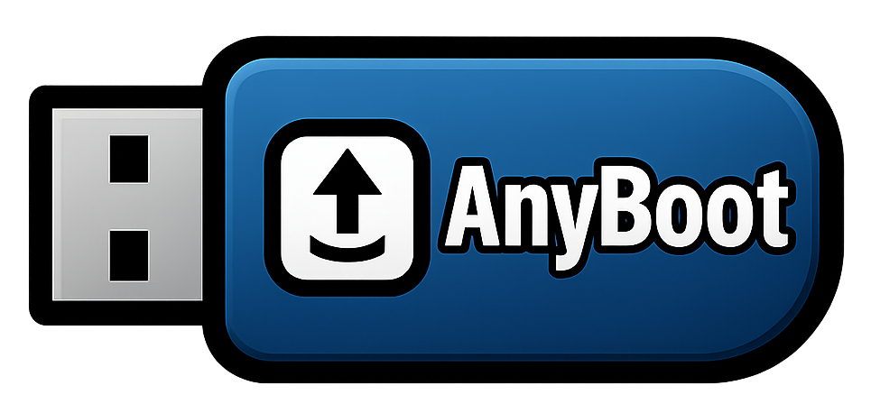

# AnyBoot

**Your Multi-Boot Workstation, Simplified.**

<!-- Badges - Centering these often uses 
 in GFM -->
    

---

## About AnyBoot

AnyBoot is a portable, live-bootable application designed to help users plan, configure, and execute advanced multi-boot workstation setups with ease. It operates from a USB drive containing a minimal Debian 12 environment and enables the installation of Windows, Linux, and BSD systems into *real* hardware partitions using controlled, virtualized installers (QEMU).

**AnyBoot** aims to remove the fear and complexity from multi-booting, providing a safe, guided environment to create powerful, customized workstation environments quickly and reliably.

## The Problem We Solve

Setting up a multi-boot PC is powerful but often involves:

*   Complex and risky manual partitioning.
*   Potential bootloader conflicts breaking existing OSes.
*   Time-consuming sequential installs and multiple reboots.
*   Difficulty managing various OS installer ISOs.
*   Challenges in achieving a consistent, reproducible setup.
*   Limited options for BSD installation.
*   Inability to handle complex partition layouts.

**AnyBoot** tackles these issues head-on by providing an integrated, guided, and safer installation process.

## Key Features

*   🖥️ **Live USB System:** Boots into a minimal Debian 12 environment.
*   🖱️ **Dual User Interface:** Graphical (Ungoogled Chromium) & Text (Browsh) modes via a unified Next.js app.
*   💾 **Persistent Storage:** Uses dedicated USB partitions (incl. user-accessible exFAT) for ISOs, configs & logs.
*   📐 **Layout Designer:** Interactively plan target disk partitions.
*   🛡️ **Virtualized Installation:** Safely runs OS installers via QEMU targeting *real* partitions.
*   ➕ **Flexible & Incremental:** Install one OS now, add more later, or setup all at once.
*   🚀 **rEFInd Integration:** Automatically installs & configures the rEFInd boot manager.
*   🔄 **ISO Management:** Tools to download and update OS installation ISOs.
*   📝 **Configuration Management:** Save and load configurations for reproducible setups.
*   🛠️ **Developer Tools:** Includes QEMU, rEFInd, and other development tools.
*   📚 **Documentation:** Comprehensive documentation and guides.

## Goals

*   **Simplify:** Abstract away the complexities of partitioning and bootloader management.
*   **Enhance Safety:** Minimize risks during installation using QEMU virtualization.
*   **Provide Flexibility:** Support incremental, full, and potentially scripted setups.
*   **Ensure Portability:** Run entirely from a USB with persistent, user-accessible data.
*   **Offer Accessibility:** Cater to users via both GUI and Text interfaces.
*   **Facilitate Reproducibility:** Allow saving and loading of configurations.

## Technology Stack

AnyBoot leverages a modern web stack within a tailored Linux environment:

*   **Base OS:** Debian 12 Live
*   **App Framework:** Next.js (React)
*   **Backend/API:** Next.js API Routes
*   **Async Tasks:** Redis Queue
*   **Virtualization:** QEMU/KVM + OVMF (UEFI)
*   **Databases:** MongoDB (Config/State) & SQLite (Tracking)
*   **Bootloader:** rEFInd

For a detailed breakdown, see [project-techstack.md](project-techstack.md).

## Getting Started

*AnyBoot is currently under active development. These are the intended steps:*

1.  **Download:** Obtain the latest AnyBoot USB image (`.img` file).
2.  **Flash:** Write the image to a USB drive (minimum 16GB recommended) using tools like BalenaEtcher or `dd`.
3.  **Boot:** Boot your computer from the prepared AnyBoot USB drive.
4.  **Setup Persistence:** On first boot, follow the prompts to set up the persistent partitions on the USB drive itself.
5.  **Use AnyBoot:** The main application will launch automatically. Use the interface (GUI or Text) to:
    *   Design your target disk layout.
    *   Select OSes and provide ISO download links.
    *   Initiate the installation process.
    *   Follow the on-screen instructions for each OS installation within the QEMU window.
6.  **Reboot:** Once AnyBoot confirms completion and rEFInd setup, reboot your system (removing the AnyBoot USB) into your new multi-boot environment!

## Current Progress & Roadmap

This project is in its early stages. Development progress, including planned features, epics, and user stories, is tracked in the [**Project Plan**](project-plan.md).

The initial focus (v1.0 target) is on delivering the core workflow for installing Windows 11 and common Linux distributions (e.g., Ubuntu) reliably.

## Contributing

Contributions are welcome! Whether it's bug reports, feature suggestions, documentation improvements, or code contributions, your help is appreciated.

1.  **Issues:** Please check the existing [Issues](https://github.com/YourUsername/anyboot/issues) before creating a new one. Use templates if available.
2.  **Pull Requests:** For code changes, please open an issue first to discuss the proposed changes. Follow the guidelines in `CONTRIBUTING.md` (to be created) and ensure adherence to the [Coding Guidelines](coding-guidelines.md).
3.  **Code Style:** Please follow the guidelines outlined in [coding-guidelines.md](coding-guidelines.md).

## License

This project uses the **Elastic License 2.0** (ELv2). We chose this license because:

*   **Open Source for Security:** The source code is available for review and audit, enhancing security and trust.
*   **Free for Personal Use:** Individuals can freely use AnyBoot for personal projects and non-commercial purposes.
*   **Commercial Use Available:** For commercial use, please contact us to discuss licensing options.

See the [LICENSE](LICENSE) file for full details.

---

*Copyright © 2025 Dataloes / Mikkel Georgsen*